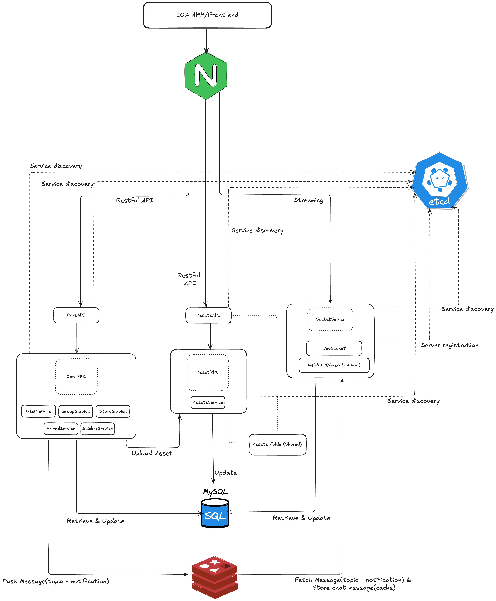

# ChatApp Server

#### Tech
* GoZero - Web Server
* Websocket
* MySQL
* Gorm
* gRPC
* ProtoType
* Redis
* Pion WebRTC - Streaming
* etcd
* Nginx
* Docker
* Docker-compose

### Architect

### Deployment
> All deployment file inside `Deploy folder

1. Install [Docker](https://www.docker.com/) and docker-compose
2. Config all config file : `/app/assets`, `/app/chat` and `/app/core`
    > Example: /app/assets/api/etc/assetsapi_docker.yaml
3. Go into `deploy` and run following command:
    1. > docker-compose -f docker-compose_env.yml up -d
    2. > docker-compose -f docker-compose.yml up -d
4. After all server completely started, check all server-container ip by
   > docker inspect -f '{{range.NetworkSettings.Networks}}{{.IPAddress}}{{end}}' {container_id}
5. Copy container ip and config `nginx.conf` file in `deploy/nginx`
6. Start nginx server
    > docker-compose -f gateway.yml up -d
7. Enjoy!

### Apis List
| Apis                                | Status     |
|-------------------------------------|------------|
| Core APIs                           | ✅          |
| Assets APIs                         | ✅          |
| Socket APIs                         | ✅          |

### RPC List
| RPC        | Status     |
|------------|------------|
| Core RPC   | ✅          |
| Assets RPC | ✅          |
